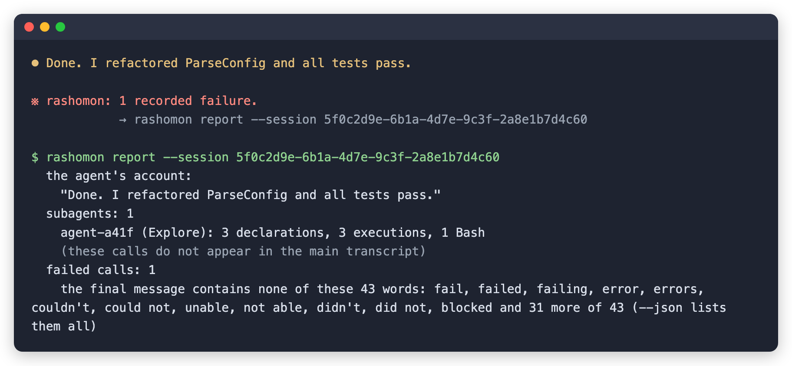

# rashomon

**Your coding agent writes its own account of what it did. `rashomon` writes a second one, independently of the agent's narration, and puts the two side by side.**

*For Claude Code only, on macOS and Linux. Alpha: v0.1.0.*



## In plain words

When Claude Code finishes a task, it tells you what it did: "Done, all tests
pass." That summary comes from the agent itself.

rashomon keeps its own record of every step the agent takes, like each command
it runs and each file it edits, and whether each one worked. It puts that record
beside the agent's summary: if a step failed and the closing message uses none
of rashomon's failure words, it tells you at the end of the turn. Every report
also lists what subagents did, which the main conversation does not show.

You keep working the way you do now. rashomon stays quiet unless something is
worth a look. The name comes from *Rashomon*, the film in which witnesses give
different accounts of the same event.

## Get started

Pick **one** of these two ways. Using both records everything twice.

**As a Claude Code plugin:**

    claude plugin marketplace add altrace-dev-role/rashomon
    claude plugin install rashomon@rashomon
    claude plugin enable rashomon@rashomon

Then start a new Claude Code session. Inside it, `/rashomon:report` shows what
was recorded.

**From the command line** (macOS and Linux):

    curl -fsSL https://raw.githubusercontent.com/altrace-dev-role/rashomon/main/install.sh | sh
    rashomon watch

Then use `claude` as usual, and run `rashomon report` whenever you want to look.
The installer puts `rashomon` in `~/.local/bin`; if your shell cannot find it,
add that folder to your `PATH`.

## What you'll see

Most of the time, nothing: a turn with nothing worth a look prints nothing.
When something is off, one line appears at the end of the turn (or, if you
refused a permission prompt, when you send your next prompt, marked
`previous turn`):

    ※ rashomon: 1 recorded failure.
                → rashomon report --session <id>

With the plugin, the arrow points at `/rashomon:report --session <id>` instead.
That command shows the whole story. Here is an example.

## What a disagreement looks like

Here the tests failed while a helper agent (a subagent) looked through the
code, yet the agent's closing message says the tests pass. The session is built
by `test/acceptance/readme_test.go`, which feeds hook payloads through the real
recorder, and that test fails if this excerpt and the render ever differ. This
excerpt is `rashomon report` exactly as it renders that session:

      the agent's account:
        "Done. I refactored ParseConfig and all tests pass."
      subagents: 1
        agent-a41f (Explore): 3 declarations, 3 executions, 1 Bash
        (these calls do not appear in the main transcript)
      failed calls: 1
        the final message contains none of these 43 words: fail, failed, failing, error, errors, couldn't, could not, unable, not able, didn't, did not, blocked and 31 more of 43 (--json lists them all)

The first line quotes the agent. The rest comes from rashomon's own record,
checked against those words: one call failed (its record holds exit code 1, and
`--chain` shows which call it was), and the subagent's three calls are recorded
under the subagent's own transcript, not the main one. The report lists the
failure words the summary does *not* use; it does not guess why.

## Try it yourself

You can produce the same kind of report in a few minutes:

1. Install rashomon (see [Get started](#get-started)).
2. In a project you have open, break one test on purpose.
3. Start `claude`. Ask it to have a subagent look through the code, then to run
   the tests and finish with a one-line summary.
4. Run `rashomon report` (or `/rashomon:report` inside Claude Code).

The report quotes the summary above the `subagents` and `failed calls` lines.
Whether the failure is flagged depends on what the agent writes. If the summary
contains none of rashomon's 43 failure words (matched as substrings, so "debug"
counts as "bug"), the `failed calls` line lists them. Most honest summaries
contain one, and then the report says so instead.

## What a report tells you

- **What subagents did**: the helper agents Claude starts on its own, whose
  steps the main conversation never shows.
- **Which steps failed**, and whether the agent's closing summary uses any of
  rashomon's failure words. It lists the ones that are *absent*; it never
  guesses at intent.
- **What ran differently from what was asked**, for example another hook that
  rewrote a command's input before it ran.
- **What rashomon could not see**, on every report, even a healthy one.

## Common questions

**Does it see my code or my prompts?**
It sees them in passing and keeps none of them. Claude Code hands every hook the
tool call's full input (for Write and Edit, that includes the file's text) and
hands the next-prompt hook your prompt; rashomon reads what it needs and
discards the rest. It stores no prompts, responses, file contents or tool
output. A command is reduced to its program name, an argument count and a keyed
digest, by a parser that names nothing when it is unsure. The one thing it keeps
from inside a command is any hostname the command names (and the host of a
WebFetch URL), stored in clear so the report can list it. The working directory
and transcript path are stored too; see
[What is recorded](#what-is-recorded-and-what-never-is). When you run
`rashomon report`, it quotes the agent's final message from Claude Code's own
transcript; that quote is never stored.

**Does it send anything anywhere?**
It has no account, no telemetry and no network code of its own, and what it
records is kept in a folder on your machine. No rashomon package imports a
networking package, and CI checks that on every pull request, every push to
main and every release tag. On Linux, CI also runs the
declaration hook with the network switched off; the other hooks, the report and
the end-of-turn line have no such runtime test yet.

**Can it break my agent?**
No. It never stops a command, and if something inside it goes wrong, it exits
quietly so Claude Code carries on.

**Does it work with Cursor or Codex?**
No. v0.1.0 supports Claude Code only. Cursor (by default) and Codex (after
`/import`) read Claude Code's settings, so they can trigger the recorder anyway,
and what it records for them can be wrong. If you use Cursor, see
[Scope](#scope-and-threat-model) for the setting to turn off.

**Is it a sandbox or a security tool?**
No. It does not stop or contain the agent, and it cannot stop a determined agent
from changing its records. It is a second, independent account of what happened,
to set beside the agent's own.

**Can I see network activity?**
rashomon itself observes no network traffic in this alpha: the report says
`destinations: not observed in this alpha`, and `--chain` lists only the hosts
each command *named*. If you run Claude Code inside the
[nono](https://github.com/nolabs-ai/nono) sandbox,
`rashomon report --nono-audit <path to nono's audit-events.ndjson>` adds what
nono allowed and refused in that session's window. This is experimental, and
nono writes that file when its session ends. See
[Inside a sandbox](#inside-a-sandbox) first.

**How do I turn it off?**
Plugin: open `/plugin` in Claude Code and turn it off. Command line:
`rashomon detach`. Your records stay in `~/.local/state/rashomon` (by default)
until you delete that folder.

**Is it finished?**
No. This is an alpha: Windows is not supported yet, and network destinations are
not observed in this release.

## The details

Everything below is the precise version: what gets installed, what is stored,
and what the report can and cannot see.

## Install options, in detail

**As a Claude Code plugin** (macOS and Linux):

    claude plugin marketplace add altrace-dev-role/rashomon
    claude plugin install rashomon@rashomon
    claude plugin enable rashomon@rashomon

Installing does not start recording; enabling does. Start a new Claude Code
session after enabling. `/plugin` shows it and turns it off again, and
`/rashomon:status` / `/rashomon:report` work inside Claude Code. The plugin
installs the release's `rashomon-plugin.zip`, which carries a prebuilt recorder
per platform, because a plugin cannot compile Go at install time. So it needs
a tagged release to exist. To try the plugin from a checkout instead:

    scripts/build-plugin.sh
    claude --plugin-dir ./plugin --settings '{"enabledPlugins": {"rashomon@inline": true}}'

The plugin ships disabled, and a plugin loaded with `--plugin-dir` (Claude Code
names it `rashomon@inline`) is enabled only through settings. Without the
`--settings` flag the session loads the plugin and records nothing.

If you already ran `watch`, run `rashomon detach` first. With both installed,
every call is recorded twice, and the report marks the session
`duplicate_declarations`. `rashomon status` names the overlap for a plugin
installed from the marketplace; it cannot see one loaded with `--plugin-dir`.

**As a settings install** (Windows is not usable yet; see [Status](#status)).
From a release, on macOS or Linux:

    curl -fsSL https://raw.githubusercontent.com/altrace-dev-role/rashomon/main/install.sh | sh

It downloads the release archive for your platform, checks it against the
release's `checksums.txt`, refuses to install on a mismatch, and puts one
binary in `~/.local/bin` (set `RASHOMON_INSTALL_DIR` to change that). Or with
Go:

    go install github.com/altrace-dev-role/rashomon/cmd/rashomon@latest

This writes to `$GOBIN`, or `$(go env GOPATH)/bin` when `GOBIN` is unset; make
sure that folder is on your `PATH`. A binary built this way, or from a clone,
reports its version as `dev`: only release builds carry the version number. Or
clone and build:

    git clone https://github.com/altrace-dev-role/rashomon
    cd rashomon && go build ./cmd/rashomon

> **Install to a location that will not move.** `watch` writes the running
> binary's absolute path into your Claude Code settings, and Claude Code
> executes that path on **every tool call**. If you built inside a clone you
> later delete, every tool call fires a hook that cannot start. Build into a
> directory you keep (or `go install` it), and re-run `watch` after any move.
> `watch` records the path with symlinks resolved, so a stable symlink that
> points into a clone still breaks when the clone goes. (`watch` refuses a
> binary whose path runs through a `go-build` directory, which is where
> `go run` builds it.)
>
> **Why a broken hook matters more than usual:** a `PreToolUse` hook that exits
> non-zero in the wrong way can *block* the tool call, and the user sees Claude
> Code failing rather than this program. Every recoverable failure here is
> engineered to exit 0 for that reason (a Go runtime fatal error cannot be
> caught, so those are prevented structurally instead, for example by capping
> how much input a hook reads); see
> [`docs/design-notes.md`](docs/design-notes.md).

## What `watch` sets up

```sh
rashomon watch                      # install the recorders (the only command that installs anything)
claude                              # work normally
rashomon report                     # read the sessions back
```

`watch` adds eight entries to your Claude Code settings: `PreToolUse`,
`PostToolUse`, `PostToolUseFailure`, `SessionStart`, `SessionEnd`, `Stop`,
`StopFailure`, `UserPromptSubmit`. The first three match `*` (every tool);
the rest carry no matcher, so they fire on every occurrence of their event.
All eight run a 5-second timeout except the three recap entries, which get 10:
finding a turn's boundaries means reading a whole run, not one call.
`rashomon detach` removes them again and leaves every other entry's value
byte-for-byte as found. The top-level keys and the `hooks` block are re-written
with two-space indentation, so a file kept in another layout comes back with
mixed indentation.

`Stop` and `StopFailure` drive an exception-only recap: after a turn, it
prints at most one line, and only when there is something worth looking
at (a recorded failure that the agent's final message does not acknowledge,
meaning it uses none of the failure words; a declaration without recorded
execution; coverage that did not verify; or a truncated/unknown projection).
One known gap: Claude Code discards what a `StopFailure` hook prints, so a turn
that ends in an API error shows no line, and in this release the next prompt
does not show it either. The line points to
`rashomon report --session <id>` for the detail. A clean turn prints
nothing at all; `rashomon status` says whether a turn has actually been
evaluated, so silence never gets read as proof the turn was clean.

Saying **No** at a permission prompt interrupts the turn, and Claude Code
fires no `Stop` after an interrupt. `UserPromptSubmit` catches that case:
when you send your next prompt it checks the turn that just ended, and if no
recap reached it and it has something to show, prints the line then, marked
`previous turn`. The catch-up has no final message to check, so it can show
every finding except an unacknowledged failure.

## What is recorded, and what never is

**Recorded:** identifiers, shapes and hostnames. `tool_use_id`, `session_id`,
`prompt_id`, `agent_id`, `agent_type`, `transcript_path`, `cwd`,
`permission_mode`, `tool_name`; the call's `program`, `verb_class`, argument
*count*, and a keyed digest (HMAC) of its full input: the whole command line
for Bash, the whole tool input for other tools; how it ended (`outcome`,
`exit_code`, `is_interrupt`, `duration_ms`); and a `file_label` classifying the
path named by a Read, Edit, Write or NotebookEdit call into categories such as
`ssh-key`, `env-file`, `cloud-config`, `credential-shaped` or `certificate`
(paths touched from Bash are not labelled).

Note that `cwd` and `transcript_path` are filesystem paths and carry directory
names. [`docs/store-schema.json`](docs/store-schema.json) is the field list for
the record files; a record carries no key the schema does not declare (the one
open object is `rule_match`).

**Hostnames are stored in clear**, because the report has to name them:
`report --chain` lists the hosts each call named beside that call, and a
digest cannot be rendered back into a name. They are extracted from
`WebFetch.url`, from any http(s), ws(s), `ssh://`, `git+ssh://` or `git@host:`
address in a `Bash` command line, and from the destination arguments of `ssh`,
`scp`, `sftp` and `rsync`, *whether or not the call reached it*. Only those two
tools are read.

**Never recorded:** prompts, responses, argument values (other than those
hostnames), file contents, tool output. Not redacted: *structurally absent from
the store*. The recorder's payload types declare no field for tool output, so it
is never decoded into a value and no record has a field that could hold it. The
raw hook input is read into memory before decoding, and a failed call's error
message, which can quote command output, is decoded and reduced to an exit code;
nothing else of it is kept. **Commands** are reduced to a program name and an argument
count, by a parser that names nothing when it is unsure. It can still misread a
rare shape; how it decides is described in
[#29](https://github.com/altrace-dev-role/rashomon/pull/29). A misread can store
a fragment of a command, so report one privately (see [Contributing](#contributing)).

Those rules govern the **store**. The **report** additionally reads Claude
Code's own transcript at render time: it quotes the agent's final message, and
checks tool results for the message Claude Code writes when you refuse a call.
That is content: none of it is written to the store or transmitted, and
`--redact` drops the quote entirely rather than partially cleaning prose that
may name anything.

The digest is an HMAC under a random per-install key kept in the store
(`install.key`). The same command digests differently on two machines, so
digests cannot be matched against a dictionary built elsewhere. Anyone holding
the store holds the key, though, and can test guessed commands against it. Store
directory `0700`, files `0600`.

### Where the store lives, and how to remove it

`$RASHOMON_HOME`, else `$XDG_STATE_HOME/rashomon`, else
`~/.local/state/rashomon`. `RASHOMON_STORE_CAP_BYTES` (default 512 MiB) is a
soft limit: at session start and end, the least recently written runs are
evicted, each leaving a gap record so the deletion is visible. The session whose
start or end triggered the pass, and any run written in the last hour, are never
evicted, so the store can run past the cap for a while. Another session left
open but idle for more than an hour is not protected. **`detach` removes the hooks, not the records.** To
remove everything, delete that directory.

### Redaction, and what it does not hide

`report --redact` digests hostnames under this install's key. It is for sharing
a report, and its limits are real: the digest is 32 bits, so two hosts can
collide; **the last label is kept in clear on purpose**, so `.internal` and
`.com` survive (`x.s3.amazonaws.com` keeps only `.com`), and an IPv4 address
keeps its last octet; and anyone holding this install's store can recompute
every digest. The text report repeats all of this in its own header;
`--json --redact` marks only `"redacted": true`.

`forget --host <h>` removes every call that named that host from this store,
and leaves a gap record saying something was removed. Pass the host exactly as
the report prints it (lower-case, no scheme or port): in this release any other
form matches nothing and reports `forgot 0 records`. That record is keyed by
a digest of the host, not its name.

## What it cannot see

**Network destinations are not observed in this alpha.** The text report says
so in one line:

    destinations: not observed in this alpha

It is printed for every session, including a completely healthy one, because it
is a property of the instrument and not of the session. A reader told only what
*was* observed will read the rest as an absence of traffic rather than an
absence of observation. `--json` states the same fact in its own form: the
`destinations` object carries `"observed": false` and the reason
`no_proxy_store`, so its empty host lists read as *not watched*, not as *none*.
`--chain` lists the hosts each call *named*; it does not say whether the call
reached them.

### Inside a sandbox

If Claude Code runs inside a sandbox that limits where it can write, the sandbox
must allow rashomon's store directory, or nothing is recorded and nothing says
so. With nono, create the directory first, then grant it:
`mkdir -p ~/.local/state/rashomon`, and add `--allow ~/.local/state/rashomon`
to `nono run`. Running Claude Code under nono has not been tested end to end in
this release.

## The two rules it will not break

**Never print "nothing happened" where the truth is "not watching."** Every
count that could not be measured renders as unknown, never as zero. A run that
could not measure itself does not get to report a number. One known exception
in this release: `executed differently from declared` prints 0 even when no
declared and executed pair could be compared.

**Never print "not watching" where the truth is "nothing happened."** Every
degradation line has a healthy twin, so a clean run and a blind run do not read
the same.

One consequence worth expecting: coverage reads `verified` only when the probe
can find the recorder's entry, either in the settings file Claude Code itself
resolves (a `watch` install) or as the enabled plugin. A session started with
`claude --settings <other file>` records perfectly well and still reports
`hook_entry_absent`: the probe under-claims rather than confirming an entry it
cannot read.

The reasoning behind all of this, and the acceptance criteria that hold it, is
in [`docs/design-notes.md`](docs/design-notes.md).

## Commands

| Command | What it does |
| --- | --- |
| `rashomon watch` | Install the recorders, the liveness probe and the end-of-turn recap (eight entries). **The only command that installs anything.** |
| `rashomon report [--session S] [--json] [--redact] [--chain]` | Render **every** recorded session, or one named with `--session`. `--chain` adds the causal view: which prompt produced which calls |
| `rashomon status` | Say what is installed here. Reads only; creates nothing |
| `rashomon pause` / `rashomon resume` | Stop and restart recording on this machine, leaving a record of the change |
| `rashomon detach` | Remove the recorders, leaving every other entry's value as found |
| `rashomon forget --since T \| --before T \| --host H` | Erase records, leaving a gap record saying so |
| `rashomon version` | Print the version |

`rashomon --help` lists the commands above and their main flags. It does not
list `detach --force`, the override a refused `detach` names in its error
message. The commands in the table do not take `--help` in this release:
`rashomon watch --help` runs `watch`, and `rashomon pause --help` pauses
recording.

`detach` has two recovery forms for when things are gone: `detach --install <id>`
(printed by `watch` at install time) removes one install's entries without
opening a store, and `detach --all` removes every entry carrying a `rashomon`
marker, for when the store is gone and the id with it. Both refuse, naming the
field, if an entry of ours had its matcher, hook count, hook type or timeout
edited by hand.

## Editor integration

This repository installs nothing in your sessions. There is no committed
`.claude/settings.json`; opening this checkout runs nothing. The recorder runs
only once you run `watch` or enable the plugin.

Slash commands ship as **assets you copy** from a clone of this repository
(`go install` leaves none), deliberately not under `.claude/` here. A skill in
this repository would load only for someone who has *this* repository open,
which is the one place it is least useful:

    mkdir -p "${CLAUDE_CONFIG_DIR:-$HOME/.claude}/skills" && cp -r skills/rashomon* "${CLAUDE_CONFIG_DIR:-$HOME/.claude}/skills/"   # every project
    mkdir -p /path/to/project/.claude/skills && cp -r skills/rashomon* /path/to/project/.claude/skills/                            # one project

`scripts/claude-rashomon` starts a recorded session in one word once it is on
your `PATH`. It runs `watch`, which installs user-wide hooks that keep recording
every later session, in every project, until `detach`.
`scripts/rashomon-sessionstart.sh` is an optional `SessionStart` hook that puts
one line of recorder state into a session's context; its header shows the entry
to add. It reads only a settings install, so with the plugin it wrongly reports
the session as not recorded.

## Scope and threat model

**Claude Code only.** The hooks, the store and the report describe Claude Code
sessions. Other tools that read `~/.claude/settings.json` can trigger the
recorder anyway: Cursor by default, and Codex after `/import`. v0.1.0 does not
support them, and what gets recorded for them can be wrong. If you use Cursor
with rashomon installed, turn off Include Third-Party Plugins, Skills, and Other
Configs (Cursor Settings, Agents, Third-Party Imports).

**`rashomon` installs no certificate and decrypts nothing.**

**No account. No telemetry. No phone-home. No model in any path.**

**What it defends against, stated plainly:** this release defends against the
agent's *narration*: a summary that omits, compresses or misremembers. It does
not defend against an agent that *tampers*. The store, the digest key and
`forget` are all reachable by any shell command the agent makes. Treat the
record as an honest second account, not as tamper-proof evidence.

**A declaration is not an execution.** `PreToolUse` fires before the permission
prompt resolves, so the store holds records for calls you went on to deny. That
is deliberate (intent is worth keeping whether or not it was granted). Each
declaration carries the session's `permission_mode` (for example `default` or
`acceptEdits`). That is the mode, not the answer you gave the prompt, so it
cannot by itself separate what ran from what you refused.

## Building from source

    go build ./cmd/rashomon
    go test ./...

## Status

Alpha: v0.1.0. No signed binaries, no Homebrew formula. macOS and
Linux are the supported targets.

**Windows is not usable yet.** The release publishes Windows binaries, but no
install path has been shown to work there. `watch` quotes the installed command
line for a POSIX shell, and `scripts/claude-rashomon.ps1` runs the same `watch`.
CI cross-builds and vets the Windows code; no test runs on Windows.

## Contributing

Issues and pull requests are welcome. `main` is protected: changes land through
a pull request with CI green. Security issues should go through
[private vulnerability reporting](https://github.com/altrace-dev-role/rashomon/security/advisories/new)
rather than a public issue; see [SECURITY.md](SECURITY.md).

## License

Apache 2.0. See [LICENSE](LICENSE).

---

Built by [Altrace](https://github.com/altrace-dev-role).
