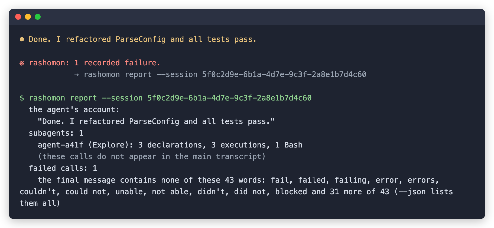

# rashomon

**Your coding agent's final diff does not tell the whole story. Rashomon shows what happened during execution.**

`rashomon` keeps an independent record of what your agent actually did, and flags when something important does not match the agent's account.

**[Join the Rashomon Discord](https://discord.gg/Qg3hybAHpU)**

*For Claude Code only, on macOS and Linux. Alpha: v1.1.0.*



## In plain words

When your coding agent finishes a task, it tells you what it did, but that summary/transcript comes from the agent itself.

rashomon keeps its own record of every step the agent takes, like each command
it runs and each file it edits, and whether each one worked. It puts that record
beside the agent's summary, and it flags discrepancies at the end of the turn in one line. 

You can access a full report that also lists what subagents did, which the main conversation does not show.

## Get started

Pick **one** of these two ways. Using both records everything twice.

**As a Claude Code plugin:**

    claude plugin marketplace add altrace-dev-role/rashomon
    claude plugin install rashomon@rashomon
    claude plugin enable rashomon@rashomon

Then start a new Claude Code session. Inside it, `/rashomon:report` shows what
was recorded.

**From the command line** (macOS and Linux):

    curl -fsSL https://raw.githubusercontent.com/altrace-dev-role/rashomon/main/install.sh | sh
    rashomon watch

Then use `claude` as usual, and run `rashomon report` whenever you want to look.
The installer puts `rashomon` in `~/.local/bin`; if your shell cannot find it,
add that folder to your `PATH`.

## What you'll see

Most of the time, nothing. A turn with nothing worth a look prints nothing.
When something is off, one line appears at the end of the turn (or, if you
refused a permission prompt, when you send your next prompt, marked
`previous turn`):

    ※ rashomon: 1 recorded failure.
                → rashomon report --session <id>

With the plugin, the arrow points at `/rashomon:report --session <id>` instead.
That command shows the whole story.

## What a disagreement looks like

Here the tests failed while a helper agent (a subagent) looked through the
code, yet the agent's closing message says the tests pass. The session is built
by `test/acceptance/readme_test.go`, which feeds hook payloads through the real
recorder, and that test fails if this excerpt and the render ever differ. This
excerpt is `rashomon report` exactly as it renders that session:

      the agent's account:
        "Done. I refactored ParseConfig and all tests pass."
      subagents: 1
        agent-a41f (Explore): 3 declarations, 3 executions, 1 Bash
        (these calls do not appear in the main transcript)
      failed calls: 1
        the final message contains none of these 43 words: fail, failed, failing, error, errors, couldn't, could not, unable, not able, didn't, did not, blocked and 31 more of 43 (--json lists them all)
      test runs: 1 (0 ok, 1 failed)

The first line quotes the agent. The rest comes from rashomon's own record,
checked against those words: one call failed (its record holds exit code 1, and
`--chain` shows which call it was), and the subagent's three calls are recorded
under the subagent's own transcript, not the main one. The last line counts the
calls rashomon recognised as a test runner (`go test`, `pytest`, `npm test` and
a fixed list of others) by how they ended. The report lists the failure words
the summary does *not* use; it does not guess why.

## What a report tells you

- **What subagents did**: the helper agents Claude starts on its own, whose
  steps the main conversation never shows.
- **Which steps failed**, and whether the agent's closing summary uses any of
  rashomon's failure words. It lists the ones that are *absent*; it never
  guesses at intent.
- **What ran differently from what was asked**, for example another hook that
  rewrote a command's input before it ran.
- **What rashomon could not see**, on every report, even a healthy one.

## Try it yourself

You can produce the same kind of report in a few minutes:

1. Install rashomon (see [Get started](#get-started)).
2. In a project you have open, break one test on purpose.
3. Start `claude`. Ask it to have a subagent look through the code, then to run
   the tests and finish with a one-line summary.
4. Run `rashomon report` (or `/rashomon:report` inside Claude Code).

The report quotes the summary above the `subagents` and `failed calls` lines.
Whether the failure is flagged depends on what the agent writes. If the summary
contains none of rashomon's 43 failure words (matched as substrings, so "debug"
counts as "bug"), the `failed calls` line lists them. Most honest summaries
contain one, and then the report says so instead.

## Common questions

**Does it see my code or my prompts?**
It sees them in passing and keeps none of them. Claude Code hands every hook the
tool call's full input (for Write and Edit, that includes the file's text) and
hands the next-prompt hook your prompt; rashomon reads what it needs and
discards the rest. It stores no prompts, responses, file contents or tool
output. A command is reduced to its program name, an argument count and a keyed
digest, by a parser that names nothing when it is unsure. The one thing it keeps
from inside a command is any hostname the command names (and the host of a
WebFetch URL), stored in clear so the report can list it. The working directory
and transcript path are stored too; see
[What is recorded](#what-is-recorded-and-what-never-is). When you run
`rashomon report`, it quotes the agent's final message from Claude Code's own
transcript; that quote is never stored.

**Does it send anything anywhere?**
It has no account, no telemetry and no network code of its own, and what it
records is kept in a folder on your machine. No rashomon package imports a
networking package, and CI checks that on every pull request, every push to
main and every release tag. On Linux, CI also runs the
declaration hook with the network switched off; the other hooks, the report and
the end-of-turn line have no such runtime test yet.

**Can it break my agent?**
No. It never stops a command, and if something inside it goes wrong, it exits
quietly so Claude Code carries on.

**Does it work with Cursor or Codex?**
No. This release supports Claude Code only. Cursor (by default) and Codex (after
`/import`) read Claude Code's settings, so they can trigger the recorder anyway,
and what it records for them can be wrong. If you use Cursor, see
[Scope](#scope-and-threat-model) for the setting to turn off.

**Is it a sandbox or a security tool?**
No. It does not stop or contain the agent, and it cannot stop a determined agent
from changing its records. It is a second, independent account of what happened,
to set beside the agent's own.

**Can I see network activity?**
rashomon itself observes no network traffic in this alpha: the report says
`destinations: not observed in this alpha`, and `--chain` lists only the hosts
each command *named*. If you run Claude Code inside the
[nono](https://github.com/nolabs-ai/nono) sandbox,
`rashomon report --nono-audit <path to nono's audit-events.ndjson>` adds what
nono allowed and refused in that session's window. If the session has no end
record, that window runs to the end of the trail, and the report says so. This
is experimental. See [Inside a sandbox](#inside-a-sandbox) first.

**How do I turn it off?**
Plugin: open `/plugin` in Claude Code and turn it off. Command line:
`rashomon detach`. Your records stay in `~/.local/state/rashomon` (by default)
until you delete that folder.

**Is it finished?**
No. This is an alpha: Windows is not supported yet, and network destinations are
not observed in this release.

## Inside a sandbox

If Claude Code runs inside a sandbox that limits where it can write, the sandbox
must allow rashomon's store, or nothing is recorded and nothing says so. Claude
Code itself keeps working.

With [nono](https://github.com/nolabs-ai/nono), create the store first and
allow it:

```sh
mkdir -p ~/.local/state/rashomon
nono run --profile claude --allow ~/.local/state/rashomon -- claude
```

Then report the session with nono's trail for that run:

```sh
rashomon report --nono-audit ~/.local/state/nono/audit/<nono session id>/audit-events.ndjson
```

`nono audit list` shows the session ids. Each `nono run` writes its own trail
when it ends.

What was measured, on macOS with nono 0.79.0 and Claude Code 2.1.285:

- With the store allowed, every tool call was recorded. Without it, or with it
  read-only, nothing was recorded.
- nono's `claude` profile already allows `/tmp/claude-<your uid>`. A store under
  that path records without `--allow`.
- The sandbox section lists Claude Code's own traffic, such as its model API and
  its log upload, on a line of its own, and does not count it as the session's.
- nono logs plain-HTTP requests it **refuses**, and not plain-HTTP requests it
  allows. An allowed `http://` request appears nowhere in the report.
- `rashomon forget --host` also keeps the host out of the sandbox section, even
  when rashomon's own records never named it.

Not yet measured: Linux (Landlock), and the comparison with the Altrace proxy's
records.

## Commands

| Command | What it does |
| --- | --- |
| `rashomon watch` | Install the recorders, the liveness probe and the end-of-turn recap (eight entries). **The only command that installs anything.** |
| `rashomon report [--session S] [--json] [--redact] [--chain] [--timeline]` | Render **every** recorded session, or one named with `--session`. `--chain` adds the causal view: which prompt produced which calls. `--timeline` lists every call, main agent and subagents, in the order they were recorded, keeps failed calls apart from calls that never ran, and says whether a success of the same command, or of the same program for single-purpose programs, was recorded after each failure, and reads "not checked" where a success may exist but cannot be placed or matched, or where the failure itself has no declaration or recorded position; for wrappers and multi-command programs such as git, go, make, npm, python and sudo, and for calls with no program such as Read or Edit, only the same command is looked for, and a fix made with a different command, or a corrected Edit, is not detected |
| `rashomon status` | Say what is installed here. Reads only; creates nothing |
| `rashomon spend [--days N] [--json]` | Estimate what the last N days of Claude Code usage would cost at API list prices, from Claude Code's own transcripts. Needs no `watch`; writes nothing. See [`rashomon spend`](#rashomon-spend) |
| `rashomon pause` / `rashomon resume` | Stop and restart recording on this machine, leaving a record of the change |
| `rashomon detach` | Remove the recorders, leaving every other entry's value as found |
| `rashomon forget --since T \| --before T \| --host H` | Erase records, leaving a gap record saying so |
| `rashomon version` | Print the version |

`rashomon --help` lists the commands above and their main flags. It does not
list `detach --force`, the override a refused `detach` names in its error
message. The commands in the table do not take `--help` in this release: each
refuses it, like any argument it does not know, with `unknown argument` and
exit status 1, and does nothing else, unless it comes where a flag expects
its value.

`detach` has two recovery forms for when things are gone: `detach --install <id>`
(printed by `watch` at install time) removes one install's entries without
opening a store, and `detach --all` removes every entry carrying a `rashomon`
marker, for when the store is gone and the id with it. Both refuse, naming the
field, if an entry of ours had its matcher, hook count, hook type or timeout
edited by hand.

### `rashomon spend`

`rashomon spend [--days N] [--json]` estimates what the last N days (default
30, at most 36500) of Claude Code usage would cost at API list prices. It needs
no `watch`, and it writes nothing.

## Status

Alpha: v1.1.0. No signed binaries, no Homebrew formula. macOS and
Linux are the supported targets.

**Windows is not usable yet.** The release publishes Windows binaries, but no
install path has been shown to work there. `watch` quotes the installed command
line for a POSIX shell, and `scripts/claude-rashomon.ps1` runs the same `watch`.
CI cross-builds and vets the Windows code; no test runs on Windows.

## Contributing

Issues and pull requests are welcome. `main` is protected: changes land through
a pull request with CI green. Security issues should go through
[private vulnerability reporting](https://github.com/altrace-dev-role/rashomon/security/advisories/new)
rather than a public issue; see [SECURITY.md](SECURITY.md).

## License

Apache 2.0. See [LICENSE](LICENSE).

---

Built by [Altrace](https://www.altrace.io/).
